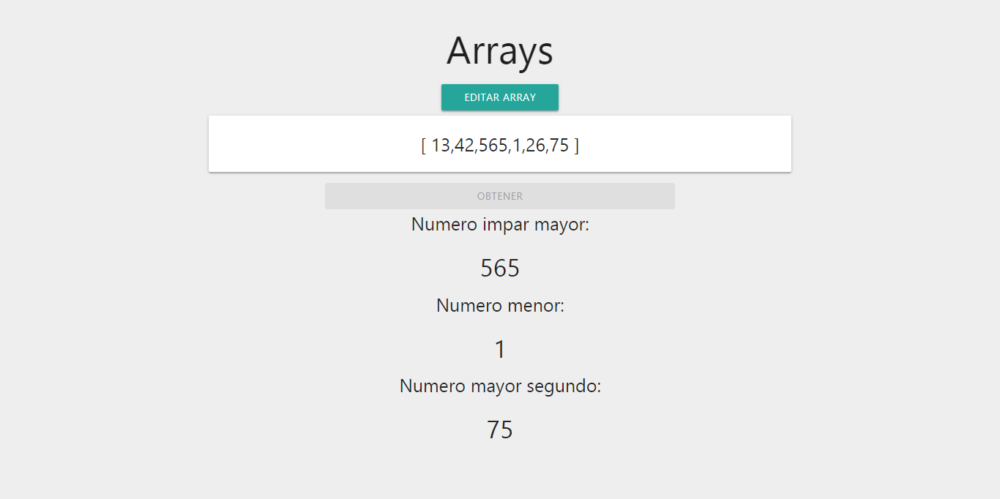

# Arrays

## Objetivo: 

- Obtener el mayor número impar del array.
- Obtener el menor número del array.
- Obtener el segundo mayor número del array.

## Extras:

- Poder modificar array.
- Web responsive.
- Framework Materialize.
- Jquery.

## Link de la página: 

- [Ingrese aquí](https://laurajimenezh.github.io/Prueba-Tecnica-PV/Ejercicio-1/)

## Autora: Laura Jimenez.

